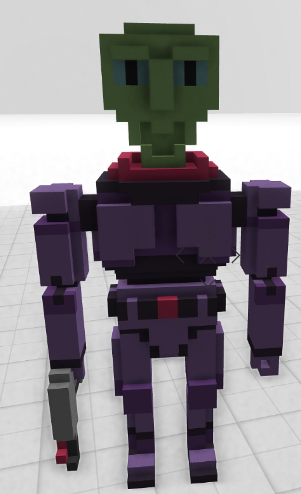

# Cryptovoxels-VOX-Library
A free public library of .vox models that can be imported inside of Cryptovoxels.

Most of these models were shared on the Discord channel: https://discord.com/channels/431671342044020747/573736707984457738

## Outdoor structures

#### Fountain

Model link: https://github.com/ries9112/Cryptovoxels-VOX-Library/blob/main/models/EVS0001_Lord_Zieg_Megavoxel_50_50_50.vox?raw=true

Discord user: 331salmon#0331

## Characters

#### Lord_Zieg

Model link: https://github.com/ries9112/Cryptovoxels-VOX-Library/blob/main/models/pushilin_fountain.vox?raw=true

ADD DISCORD USER

