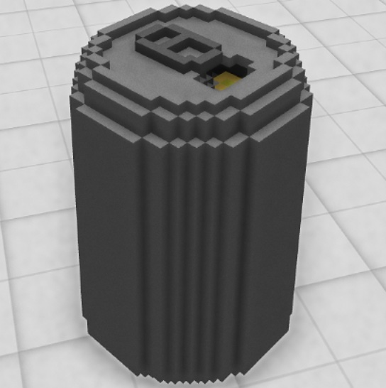
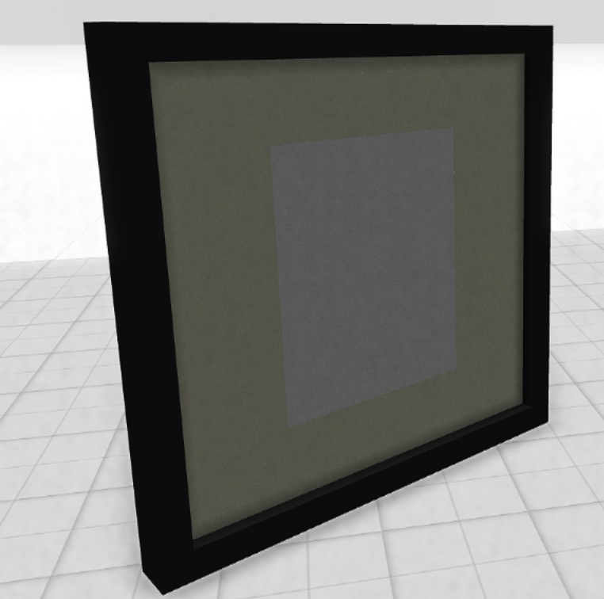

# Cryptovoxels-VOX-Library

A free public library of .vox models that can be imported inside of Cryptovoxels.

Most of these models were shared on the Discord channel: https://discord.com/channels/431671342044020747/573736707984457738

Make sure to click on the button in the top left to navigate this document to find what you are looking for by category:

  

## Indoor structures

#### Firepit

Model link: https://github.com/ries9112/Cryptovoxels-VOX-Library/blob/main/models/Firepit2.vox?raw=true

**Discord user: Gsys#0269**

#### Spiral Staircase

Model link: https://github.com/ries9112/Cryptovoxels-VOX-Library/blob/main/models/SpiralStaircaseExperiment1.vox?raw=true

**Discord user: plokmijn27#3472**

## Misc decorations

#### Popcorn Stand

Model link: https://github.com/ries9112/Cryptovoxels-VOX-Library/blob/main/models/Popcorn_Stand_126.vox?raw=true

**Discord user: Pointshark#9029**

#### Beer* can template

Model link: https://github.com/ries9112/Cryptovoxels-VOX-Library/blob/main/models/Beer_Can_Full_Open_Blank.vox?raw=true

Pointshark#9029

*doesn't have to be beer

##### Crushed can

Model link: https://github.com/ries9112/Cryptovoxels-VOX-Library/blob/main/models/Beer_Can_Crushed_Blank.vox?raw=true

**Discord user: Pointshark#9029**

## Floors

#### Confetti floor

Model link: https://github.com/ries9112/Cryptovoxels-VOX-Library/blob/main/models/confetti_floor_black.vox?raw=true

ADD DISCORD USER

## Buildings

#### Building 1

Model link: https://github.com/ries9112/Cryptovoxels-VOX-Library/blob/main/models/model_1.vox?raw=true

**Discord user: P331salmon#0331**

#### Doughnut Building

Model link: https://github.com/ries9112/Cryptovoxels-VOX-Library/blob/main/models/model_2.vox?raw=true

**Discord user: P331salmon#0331**

## Structural Components

#### Bridge 

Model link: https://github.com/ries9112/Cryptovoxels-VOX-Library/blob/main/models/bridge.vox?raw=true

**Discord user: RichardDixon#5557**

#### Balcony

Model link: https://github.com/ries9112/Cryptovoxels-VOX-Library/blob/main/models/balcony.vox?raw=true

**Discord user: RichardDixon#5557**

## Outdoor structures

#### Fountain

Model link: https://github.com/ries9112/Cryptovoxels-VOX-Library/blob/main/models/EVS0001_Lord_Zieg_Megavoxel_50_50_50.vox?raw=true

**Discord user: 331salmon#0331**

## Characters

#### Lord_Zieg

Model link: https://github.com/ries9112/Cryptovoxels-VOX-Library/blob/main/models/pushilin_fountain.vox?raw=true

**Discord user: scalynelson#6003**

#### Person

Model link: https://github.com/ries9112/Cryptovoxels-VOX-Library/blob/main/models/monsieur.vox?raw=true

Made by Ricky

## Frames

#### Black off white

Model link: https://github.com/ries9112/Cryptovoxels-VOX-Library/blob/main/models/picture_frame_black_off_white.vox?raw=true

ADD DISCORD USER

#### Gold off white with black inlay

Model link: https://github.com/ries9112/Cryptovoxels-VOX-Library/blob/main/models/picture_frame_gold_offwhite_black_inlay.vox?raw=true

ADD DISCORD USER

